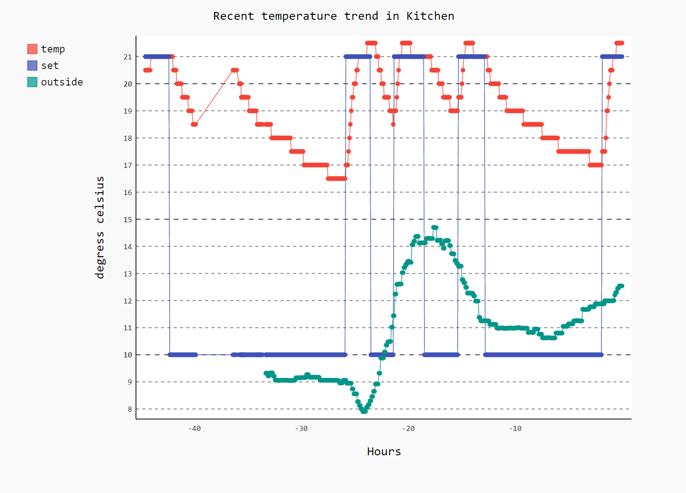

Keep data on evohome system and produce charts of recent temperatue changes on demand.

# Example

# credentials.txt format

One line per item:
- TotalConnectComfort email address
- TotalConnectComfort password
- API key for openweather https://openweathermap.org/
- City for openweather https://openweathermap.org/

Future plans:

- Spot a room not getting warmer despite temperature demand and alert people